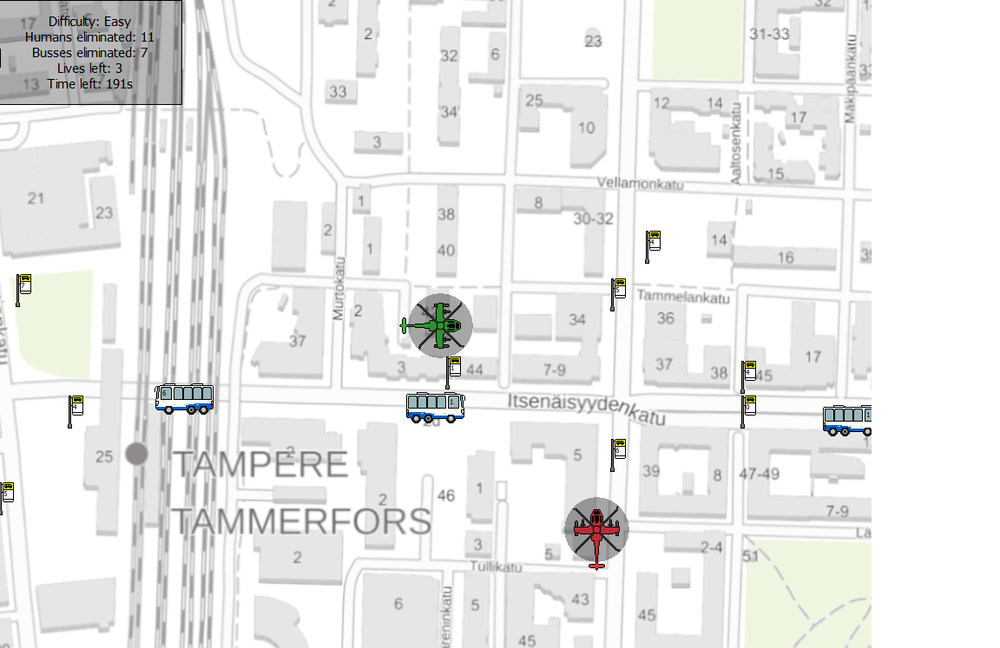
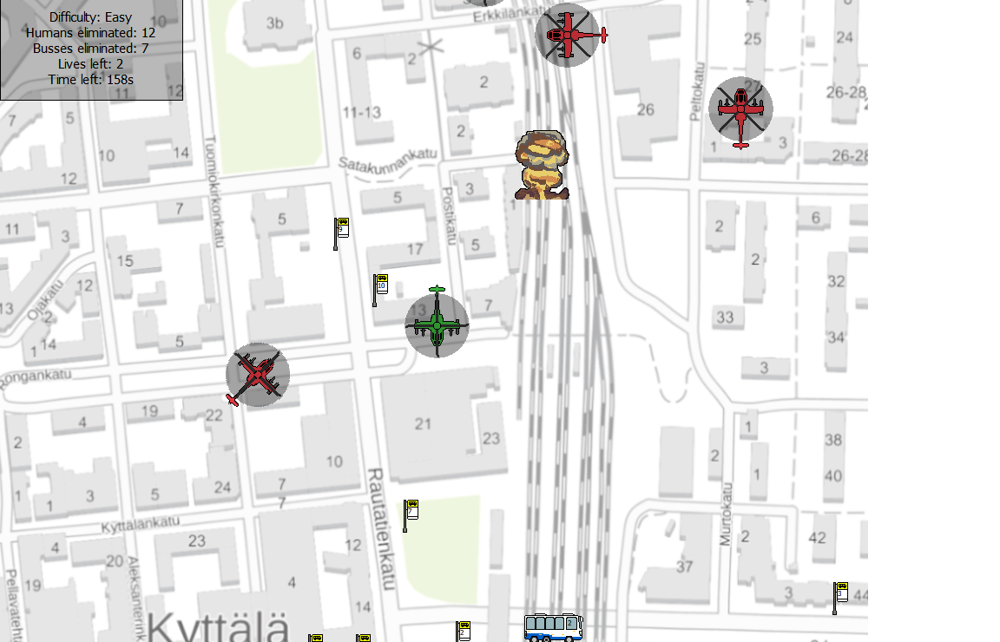

# Assignment of the course Programming 3 Tampere University.
Contents of the Course repository were preamde by Tampere University course staff. Everything else excluding the map image were made by me and github user [jliima](https://github.com/jliima). Currently the contents of the Documentation repository are only in Finnish. The comments of the code are in English however. The game is relatively straight forward so the manual is not necessary.

# Images

Ingame image 1

Ingame image2

